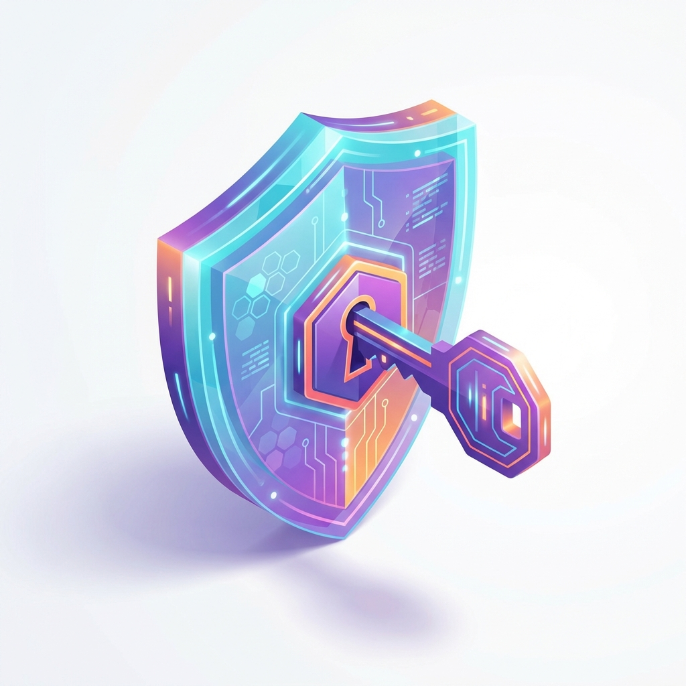
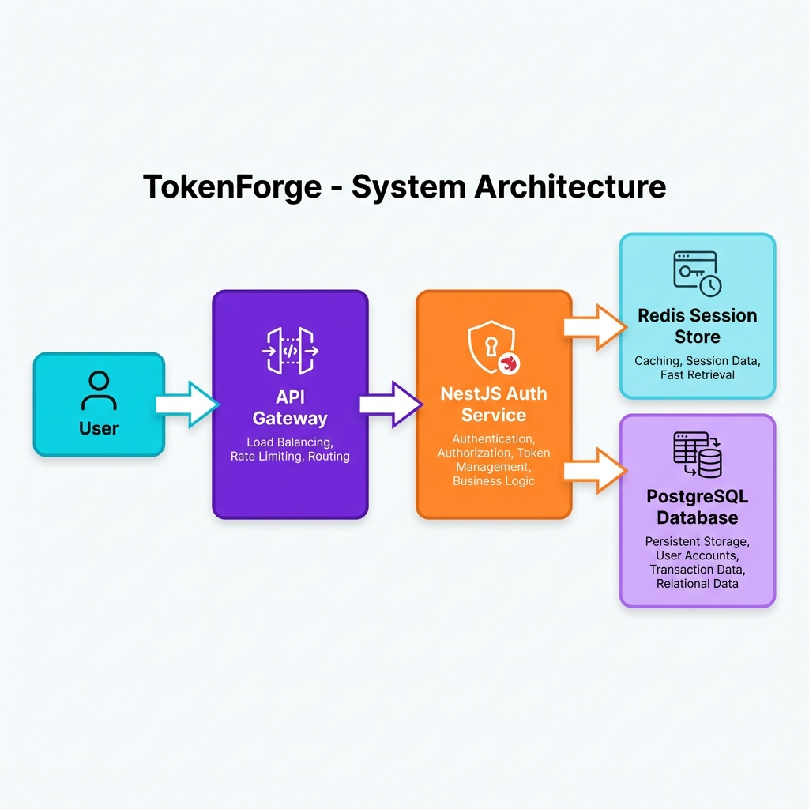
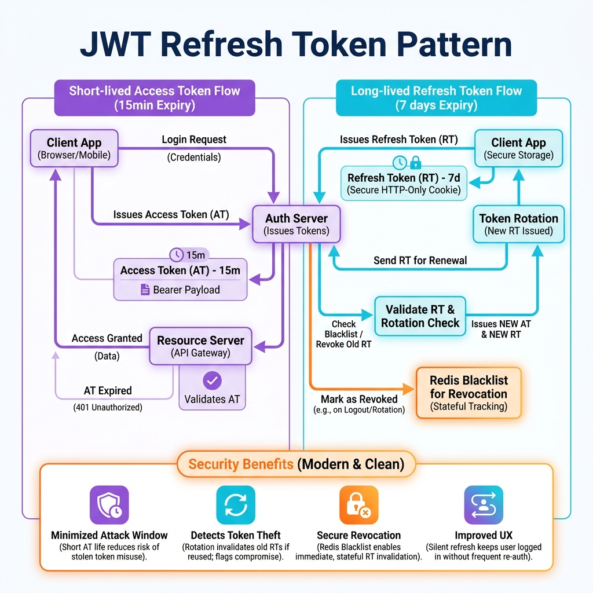
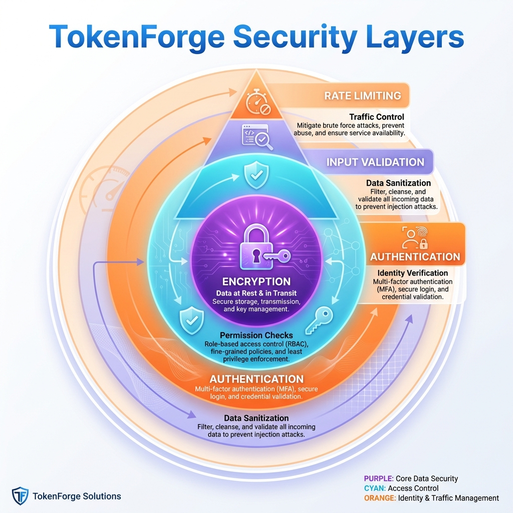
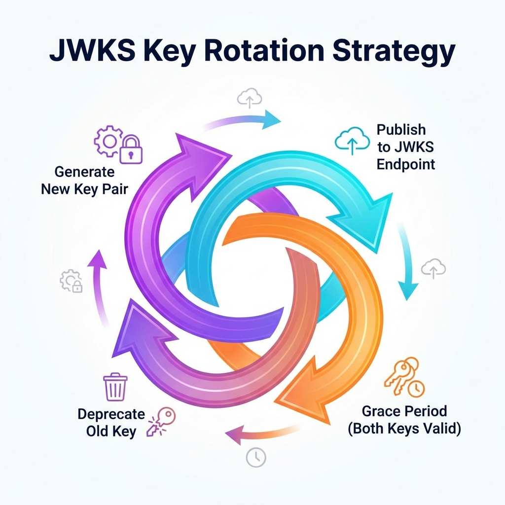

# TokenForge



## Enterprise Distributed Identity System

<div align="center">


</div>

**TokenForge** is a professional Authentication Platform built with **NestJS**. It implements the **OIDC (OpenID Connect)** standard, featuring a hybrid "Stateless Access / Stateful Refresh" architecture that balances horizontal scalability with strict security controls like Instant Revocation and Key Rotation.

---

## 🚀 Quick Start

Launch the Identity Infrastructure:

```bash
# 1. Start DB & Redis
docker-compose up -d

# 2. Start Auth Service
cd backend && npm install && npm run start:dev
```

> **Important**: Requires Docker. See [GETTING_STARTED.md](./docs/GETTING_STARTED.md).

---

## 📸 Architecture & Patterns

### 1. High-Level Architecture

*Flow: Client -> Gateway -> Redis Rate Limit -> NestJS Auth -> PostgreSQL*

### 2. The JWT Refresh Pattern

*Lifecycle: 15m Access Token (Stateless) vs 7d Refresh Token (Stateful)*

### 3. Security Defense Layers

*Defense in Depth: From Network Rate Limits to Database Encryption*

### 4. Automated Key Rotation

*JWKS Strategy: Rotating RSA keys every 30 days to limit breach impact*

---

## ✨ Key Features

*   **🛡️ OIDC Compliant**: Provides `/.well-known/openid-configuration` and JWKS endpoints.
*   **🔑 Asymmetric Security**: Uses **RS256** signatures. Only the Auth Service holds the Private Key.
*   **🔄 Rotating Refresh Tokens**: Detects token theft by rotating the refresh token family on every use.
*   **⚡ Redis-Backed**: Sub-millisecond session validation and distributed rate limiting.

---

## 📚 Documentation

| Document | Description |
| :--- | :--- |
| [**System Architecture**](./docs/ARCHITECTURE.md) | Standard Patterns, Schema, and Decision Log. |
| [**Getting Started**](./docs/GETTING_STARTED.md) | Setup Guide and Manual Verification steps. |
| [**Failure Scenarios**](./docs/FAILURE_SCENARIOS.md) | Handling DB Outages and Redis Failures. |
| [**Interview Q&A**](./docs/INTERVIEW_QA.md) | "JWT vs Session" and "RS256 vs HS256". |

---

## 🔧 Tech Stack

| Component | Technology | Role |
| :--- | :--- | :--- |
| **Core** | **NestJS 10** | Modular API Framework. |
| **Identity** | **PostgreSQL 16** | User & RBAC Storage. |
| **Session** | **Redis 7** | Token Store & Rate Limiter. |
| **Security** | **Passport.js** | Auth Strategies. |

---

## 👤 Author

**Harshan Aiyappa**  
Senior Full-Stack Hybrid Engineer  
[GitHub Profile](https://github.com/Kimosabey)

---

## 📝 License

This project is licensed under the MIT License - see the [LICENSE](LICENSE) file for details.
