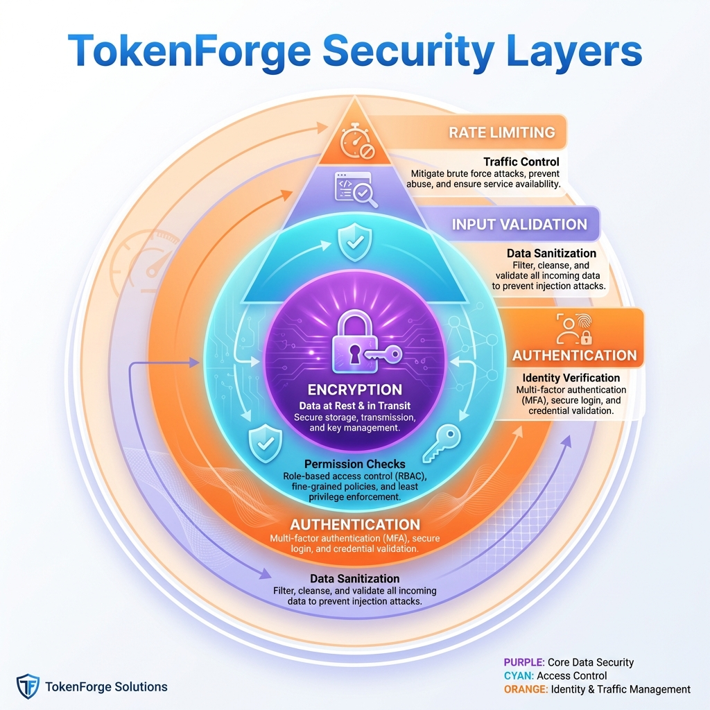
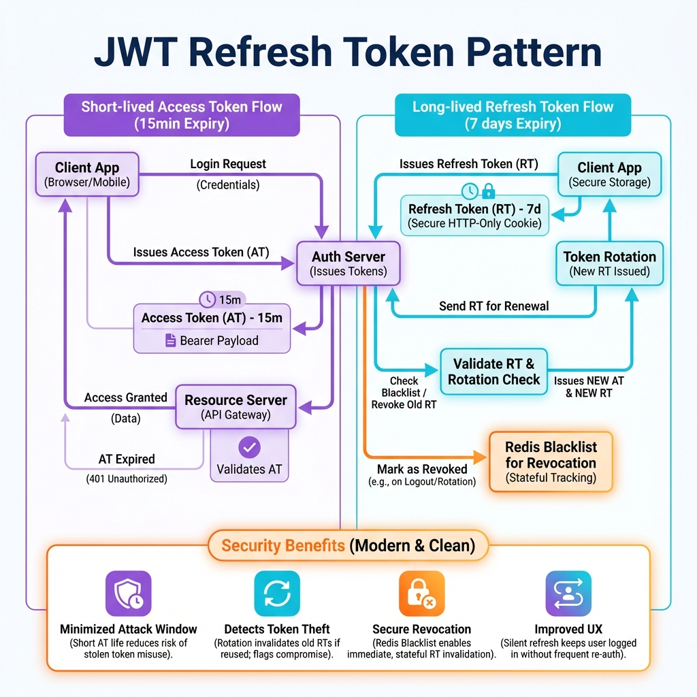
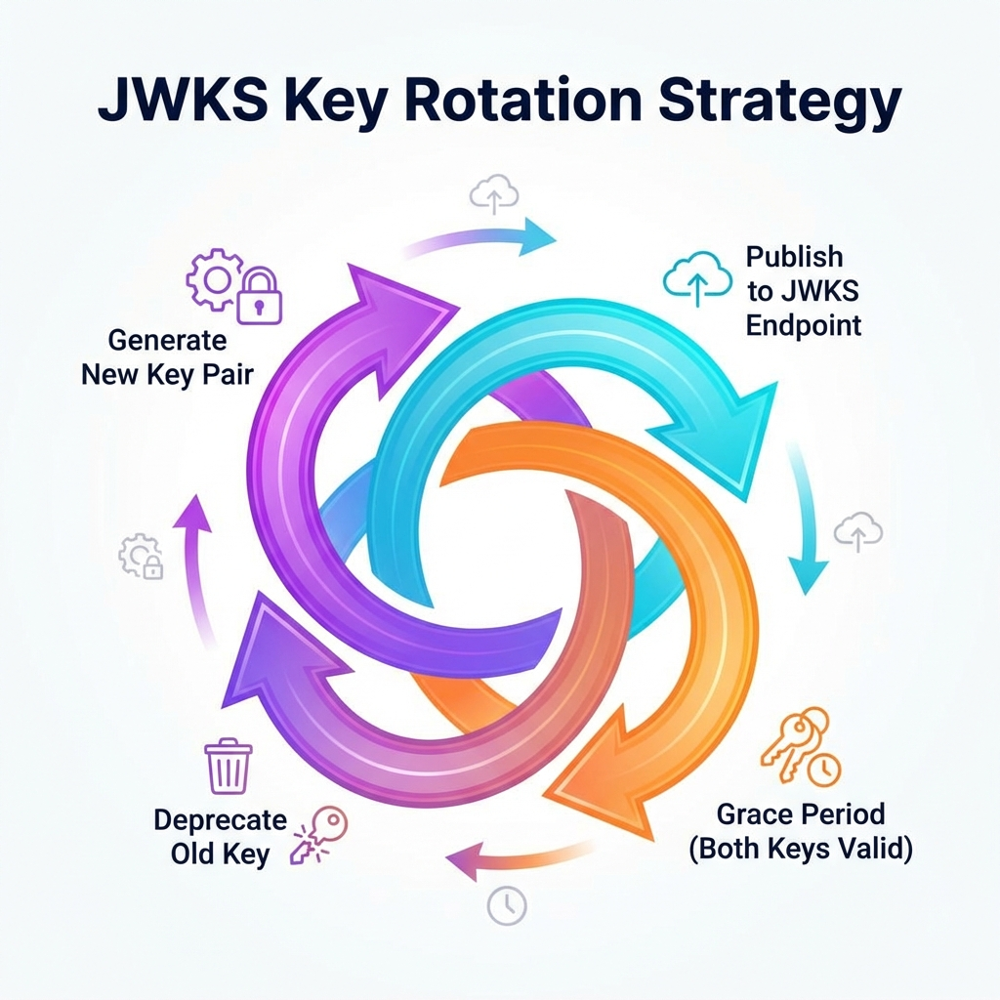

# 🛡️ TokenForge

**TokenForge** is a professional, production-ready authentication system built with **NestJS**. It provides a secure, scalable, and modular foundation for managing user identities, roles, and sessions.

> "Identity is the new perimeter."

<div align="center">


</div>

---

## 🚀 Quick Start

**Get running in 5 minutes**:

```bash
# 1. Clone repository
git clone https://github.com/Kimosabey/token-forge.git
cd token-forge

# 2. Start infrastructure (PostgreSQL + Redis)
docker-compose up -d

# 3. Install dependencies & run
cd backend
npm install
npm run start:dev
```

🎉 **Done!** Auth service running at `http://localhost:3000`

👉 **Full Setup Guide**: [docs/GETTING_STARTED.md](./docs/GETTING_STARTED.md)

---

## 🏗️ Architecture


*High-level OIDC Authentication Flow*

### Core Components

- **🔐 NestJS Auth Service**: Modular authentication engine with Passport.js
- **💾 PostgreSQL**: User accounts, RBAC, audit logs
- **⚡ Redis**: Session storage, token blacklist, rate limiting
- **🔑 JWKS**: Automated key rotation with grace periods

**Want to go deeper?** → [docs/ARCHITECTURE.md](./docs/ARCHITECTURE.md)

---

## ✨ Key Features

### 🎯 OIDC Compliance

- ✅ **Discovery Endpoint**: `/.well-known/openid-configuration`
- ✅ **JWKS Public Keys**: `/.well-known/jwks.json`
- ✅ **Standard Flows**: Authorization Code, Client Credentials
- ✅ **Token Endpoint**: `/auth/token`

### 🔐 Security-First



- ✅ **Multi-Factor Authentication (MFA)**: TOTP + Email OTP
- ✅ **Rate Limiting**: Redis-backed distributed throttling
- ✅ **Password Hashing**: bcrypt with 12 salt rounds
- ✅ **JWT Security**: RS256 signatures, automated key rotation
- ✅ **Audit Logging**: Complete authentication history

### 🔄 Token Management



- ✅ **Short-lived Access Tokens**: 15 minutes (stateless JWT)
- ✅ **Long-lived Refresh Tokens**: 7 days (stateful Redis)
- ✅ **Automatic Rotation**: New tokens on every refresh
- ✅ **Instant Revocation**: Redis blacklist for immediate logout

### 🔑 Key Rotation



- ✅ **Automated Rotation**: Every 30 days
- ✅ **Grace Period**: 24 hours with both keys valid
- ✅ **Zero Downtime**: Gradual client migration
- ✅ **Emergency Rotation**: Manual trigger for security incidents

---

## 🛡️ Tech Stack

| Component           | Technology        | Purpose                                  |
| ------------------- | ----------------- | ---------------------------------------- |
| **Backend**         | NestJS 10         | Modular auth service with TypeScript     |
| **Language**        | TypeScript        | Type-safe development                    |
| **Database**        | PostgreSQL 16     | User accounts, RBAC, audit logs          |
| **Cache/Sessions**  | Redis 7           | Token storage, rate limiting, blacklist  |
| **Authentication**  | Passport.js       | Pluggable auth strategies                |
| **Token Standard**  | JWT (RS256)       | Stateless API authorization              |
| **Compliance**      | OIDC / OAuth 2.0  | Industry-standard identity protocols     |
| **Infrastructure**  | Docker Compose    | Local development environment            |

---

## 📚 Documentation

### 📖 Setup & Operations
- **[GETTING_STARTED.md](./docs/GETTING_STARTED.md)** - Complete walkthrough (START HERE!)

### 🏗️ Architecture & Design
- **[ARCHITECTURE.md](./docs/ARCHITECTURE.md)** - System design deep dive
- **[SECURITY.md](./docs/SECURITY.md)** - Security best practices & threat model

### 🔧 Advanced Topics
- **[FAILURE_SCENARIOS.md](./docs/FAILURE_SCENARIOS.md)** - Resilience patterns
- **[INTERVIEW.md](./docs/INTERVIEW.md)** - Technical interview preparation

---

---

## 🎯 API Endpoints

### Authentication
- `POST /auth/register` - User registration
- `POST /auth/login` - User login (returns access + refresh tokens)
- `POST /auth/refresh` - Token renewal
- `POST /auth/logout` - Session termination

### OIDC Discovery
- `GET /.well-known/openid-configuration` - OIDC metadata
- `GET /.well-known/jwks.json` - Public signing keys

### User Management
- `GET /users/me` - Current user profile
- `PATCH /users/me` - Update profile
- `POST /users/me/password` - Change password
- `POST /users/me/mfa` - Enable/disable MFA

### Interactive Docs
**Swagger UI**: `http://localhost:3000/api/docs` (when service is running)

---

## 🚀 Future Enhancements

- [ ] OAuth 2.0 Social Login (Google, GitHub, Microsoft)
- [ ] WebAuthn / Passkey support
- [ ] Device fingerprinting & tracking
- [ ] Passwordless authentication (Magic Links)
- [ ] Account recovery workflows
- [ ] Admin dashboard (user management UI)
- [ ] Prometheus metrics export
- [ ] Grafana monitoring dashboards
- [ ] Kubernetes deployment manifests

---

## 📝 License

MIT License - See [LICENSE](./LICENSE) for details

---

## 👨‍💻 Author

**Harshan Aiyappa**  
Senior Full-Stack Engineer  
📧 [GitHub](https://github.com/Kimosabey) | [LinkedIn](https://linkedin.com/in/harshan-aiyappa)

---

**Built with**: OAuth 2.0 • OIDC • NestJS • Redis • PostgreSQL  
**Patterns**: JWT Security • Token Rotation • RBAC • Distributed Sessions
