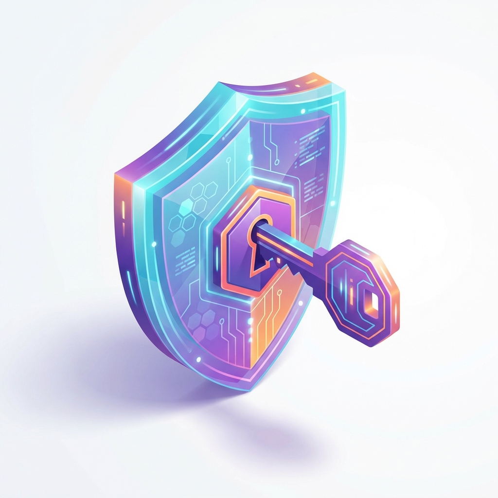
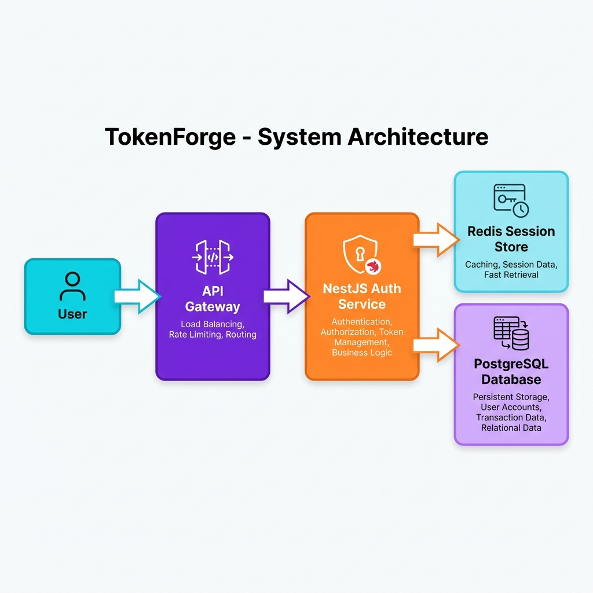

# 🛡️ TokenForge (Project #49)

**Enterprise-Grade Distributed Identity & Authentication System**

> "Identity is the new perimeter."

## 📌 Project Overview
TokenForge is a robust, security-first Authentication & Authorization service built with **NestJS**. It moves beyond simple JWT signing to implement refined enterprise patterns like OIDC (OpenID Connect), Key Rotation, Token Revocation, and Distributed Session management via Redis.

**Role Target**: Senior Backend / Platform<div align="center">




</div>

## 🏗️ Architecture


*High-level OIDC Authentication Flow*

## ⚡ Core Architecture (The "Senior Signals")
1.  **OIDC Compliance**: Implementing discovery endpoints and standardized flows.
2.  **JWT Strategy**:
    *   **Short-lived Access Tokens** (Stateless).
    *   **Rotating Refresh Tokens** (Stateful/Redis-backed).
    *   **Token Revocation**: Blacklisting via Redis.
3.  **Key Management**: Automated JWKS (JSON Web Key Set) rotation.
4.  **Security**: Comprehensive rate limiting, brute-force protection, and audit logging.

## 🚀 Getting Started

### Prerequisites
*   Node.js v20+
*   Docker & Docker Compose

### Running Locally
```bash
# Start Infrastructure (Postgres + Redis)
docker-compose up -d

# Run Application
npm run start:dev
```

## 📂 Project Structure
*   `/src/auth` - Core OIDC/OAuth logic.
*   `/src/identity` - User profile and RBAC management.
*   `/src/keys` - JWKS rotation and management.
