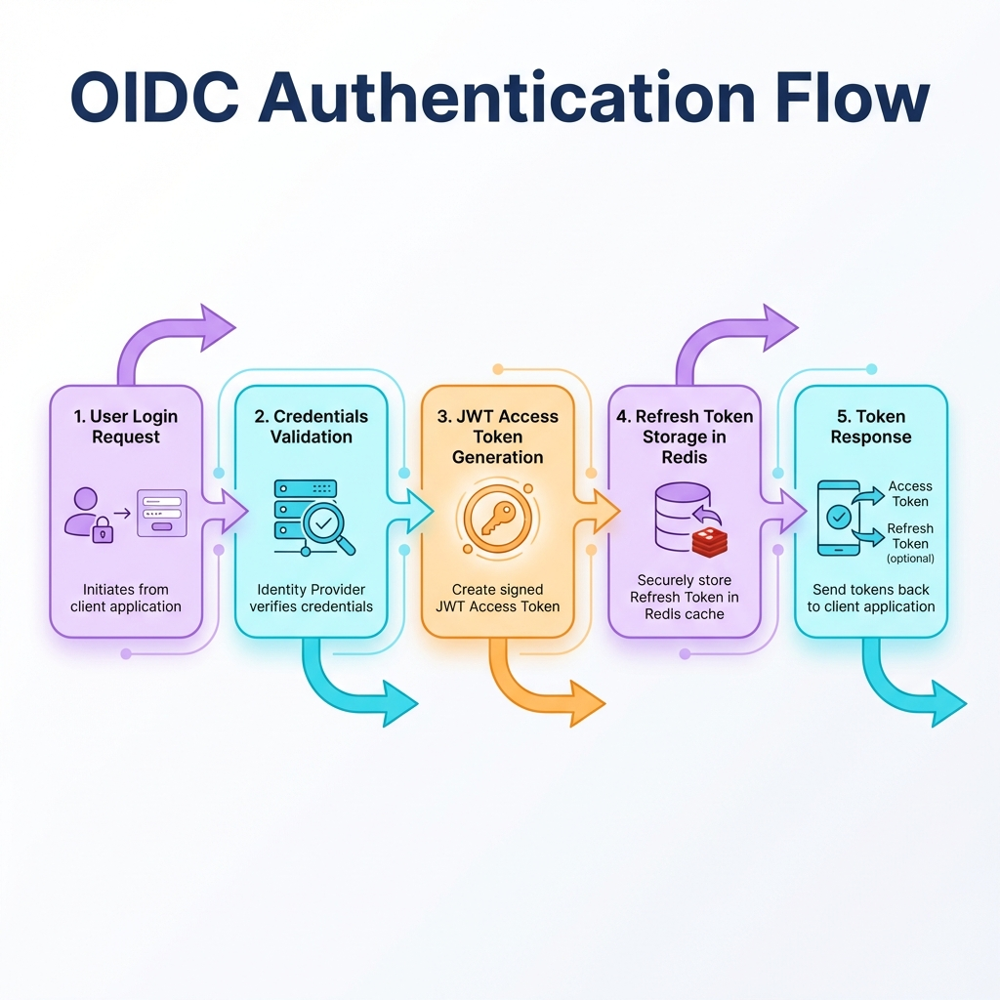

# 🏗️ TokenForge Architecture

> **Enterprise-Grade Distributed Identity & Authentication System**

## 📐 System Overview


TokenForge implements a modern, security-first authentication infrastructure based on **OpenID Connect (OIDC)** standards. The system is designed to handle enterprise-scale identity management with distributed session storage and automated key rotation.

---

## 🎯 Core Components

### 1. **API Gateway Layer**
- **Load Balancing**: Distributes requests across multiple auth service instances
- **Rate Limiting**: Protects against brute-force attacks
- **Request Routing**: Intelligent routing based on endpoint patterns

### 2. **NestJS Auth Service** (Core Engine)
- **Passport.js Integration**: Modular authentication strategies
- **JWT Management**: Token generation, validation, and rotation
- **OIDC Compliance**: Standard discovery endpoints and flows
- **Business Logic**: User management, session handling, RBAC

### 3. **MFA Service** (Security)
- **TOTP**: Time-based One-Time Password generation
- **QR Code**: Zero-trust provisioning
- **Redis Storage**: Temporary secret holding

### 4. **Email Service** (Notifications)
- **Verification**: Token-based email proofing
- **Password Reset**: Secure forgot-password flows
- **Templates**: HTML transactional emails

### 5. **Redis Session Store**
- **Refresh Token Storage**: Stateful tracking of long-lived tokens
- **Token Blacklist**: Instant revocation capabilities
- **Session Cache**: Fast access to user session data
- **TTL Management**: Automatic cleanup of expired tokens

### 6. **PostgreSQL Database**
- **User Accounts**: Identity storage with encrypted credentials
- **Audit Logs**: Complete authentication history
- **RBAC Configuration**: Role and permission definitions
- **Key Management**: JWKS (JSON Web Key Set) storage

---

## 🔐 Authentication Flow



### Step-by-Step Process

1. **Login Request**
   - User submits credentials via client application
   - Request hits API Gateway with rate limiting

2. **Credentials Validation**
   - NestJS Auth Service queries PostgreSQL
   - Password verified using bcrypt
   - User account status checked (active/suspended)

3. **JWT Access Token Generation**
   - Short-lived token (15 minutes)
   - Contains user claims (ID, roles, permissions)
   - Signed with RSA private key

4. **Refresh Token Storage**
   - Long-lived token (7 days)
   - Stored in Redis with user mapping
   - HttpOnly cookie with Secure flag

5. **Token Response**
   - Client receives both tokens
   - Access token for API requests
   - Refresh token for renewal

---

## 🔄 JWT Refresh Token Pattern


### Token Lifecycle

#### Access Token (AT)
- **Lifetime**: 15 minutes
- **Storage**: Client memory (not localStorage)
- **Purpose**: API authorization
- **Revocation**: Not possible (short TTL)

#### Refresh Token (RT)
- **Lifetime**: 7 days
- **Storage**: Redis + HttpOnly cookie
- **Purpose**: Obtain new access tokens
- **Revocation**: Immediate via Redis blacklist

### Token Rotation Strategy
When a refresh token is used:
1. Validate RT against Redis
2. Check RT not in blacklist
3. Generate NEW access token
4. Generate NEW refresh token
5. Invalidate OLD refresh token
6. Return both new tokens

**Security Benefit**: Limits the window of token theft impact

---

## 🔑 JWKS Key Rotation


### Automated Rotation Cycle

1. **Generate New Key Pair**
   - RSA-256 keys generated every 30 days
   - New `kid` (Key ID) assigned

2. **Publish to JWKS Endpoint**
   - Multiple keys exposed at `/.well-known/jwks.json`
   - Consumers fetch public keys dynamically

3. **Grace Period (24 hours)**
   - Both old and new keys valid
   - Prevents breaking existing JWTs
   - Gradual client migration

4. **Deprecate Old Key**
   - Old key removed from JWKS
   - Existing tokens with old `kid` fail validation
   - Forces re-authentication

**Why This Matters**: Limits cryptographic exposure window

---

## 🛡️ Security Architecture


### Defense-in-Depth Strategy

#### Layer 1: Rate Limiting
- **Brute-Force Protection**: Max 5 login attempts per minute per IP
- **Distributed Tracking**: Redis-backed counters
- **Progressive Delays**: Exponential backoff on failures

#### Layer 2: Input Validation
- **Schema Validation**: `class-validator` with strict DTOs
- **SQL Injection Prevention**: Parameterized queries (TypeORM)
- **XSS Protection**: Content-Security-Policy headers

#### Layer 3: Authentication
- **Multi-Factor Support**: TOTP integration ready
- **Password Policies**: Min 12 chars, complexity rules
- **Secure Hashing**: bcrypt with salt rounds = 12

#### Layer 4: Authorization
- **RBAC (Role-Based Access Control)**: Fine-grained permissions
- **Least Privilege**: Default deny policy
- **Policy Enforcement**: Guard decorators at controller level

#### Layer 5: Encryption
- **Data at Rest**: PostgreSQL encrypted volumes
- **Data in Transit**: TLS 1.3 enforced
- **Token Encryption**: JWT signed + optional payload encryption

---

## 📊 Data Models

### User Entity
```typescript
{
  id: UUID,
  email: string (unique),
  passwordHash: string,
  firstName: string,
  lastName: string,
  roles: Role[],
  isActive: boolean,
  lastLoginAt: timestamp,
  createdAt: timestamp,
  updatedAt: timestamp
}
```

### Refresh Token (Redis)
```typescript
{
  key: `rt:${userId}:${tokenId}`,
  value: {
    userId: UUID,
    tokenHash: string,
    expiresAt: timestamp,
    deviceInfo: { ip, userAgent }
  },
  ttl: 7 days
}
```

### Audit Log
```typescript
{
  id: UUID,
  userId: UUID,
  event: 'LOGIN' | 'LOGOUT' | 'TOKEN_REFRESH' | 'PASSWORD_CHANGE',
  ipAddress: string,
  userAgent: string,
  success: boolean,
  metadata: JSONB,
  timestamp: timestamp
}
```

---

## 🚀 Scalability Considerations

### Horizontal Scaling
- **Stateless Auth Service**: Multiple NestJS instances behind load balancer
- **Redis Replication**: Master-slave setup for session data
- **PostgreSQL Read Replicas**: Separate read/write workloads

### Performance Optimization
- **JWT Verification**: No DB query needed (stateless)
- **Redis Caching**: ~1ms session lookups
- **Connection Pooling**: TypeORM pool size = 20

### High Availability
- **Service Redundancy**: Min 3 auth service pods
- **Database Failover**: Automatic primary election
- **Circuit Breakers**: Resilience4j patterns

---

## 📋 API Endpoints

### Authentication
- `POST /auth/login` - User login
- `POST /auth/logout` - Session termination
- `POST /auth/refresh` - Token renewal
- `POST /auth/register` - User registration

### OIDC Discovery
- `GET /.well-known/openid-configuration` - OIDC metadata
- `GET /.well-known/jwks.json` - Public keys

### User Management
- `GET /users/me` - Current user profile
- `PATCH /users/me` - Update profile
- `POST /users/me/password` - Change password

---

## 🔍 Monitoring & Observability

### Metrics (Prometheus)
- Authentication success/failure rate
- Token generation latency
- Redis cache hit ratio
- Database connection pool usage

### Logging (Structured)
- Request ID tracing
- User action audit trail
- Error stack traces with context
- Performance timing

### Alerting
- Excessive login failures (potential attack)
- Redis connection pool exhaustion
- JWT signing key expiration warnings
- Database replication lag

---

## 🏁 Design Decisions

### Why Redis for Sessions?
- **Speed**: Sub-millisecond lookups
- **TTL**: Automatic expiration
- **Atomic Ops**: INCR for rate limiting
- **Pub/Sub**: Real-time logout broadcasts

### Why PostgreSQL for Users?
- **ACID**: Strong consistency for identity data
- **Relational**: Complex RBAC queries
- **JSON Support**: Flexible metadata storage
- **Mature Ecosystem**: Battle-tested reliability

### Why NestJS?
- **TypeScript**: Type safety end-to-end
- **Modular**: Clean separation of concerns
- **Decorators**: Elegant auth guard patterns
- **Enterprise-Ready**: Built for scale

---

**Next Steps**: See [GETTING_STARTED.md](./GETTING_STARTED.md) for setup instructions.
