# 🏗️ System Architecture: TokenForge

## 1. High-Level Design (HLD)

TokenForge is a **Distributed Identity Provider** implementing the OIDC/OAuth 2.0 standard. It decouples Authentication (Identity) from Authorization (Access), utilizing a highly scalable "Stateless Auth, Stateful Refresh" architecture.

```mermaid
graph TD
    User([👤 User / Client]) -->|1. Login Credentials| Gateway[🛡️ API Gateway]
    Gateway -->|2. Rate Limit Check| Redis[(⚡ Redis Cache)]
    Gateway -->|3. Forward Request| Auth[🔐 NestJS Auth Service]
    
    subgraph "Identity Core"
        Auth -->|4. Verify Password| DB[(🐘 PostgreSQL)]
        Auth -->|5. Generate JWT + Refresh Token| Keys[🔑 Key Manager]
        Auth -->|6. Store Refresh Token| Redis
    end
    
    Auth -->|7. Return Tokens| User
```




### Core Components
1.  **NestJS Auth Service**: The core logic engine handling Credential Validation, Token Minting, and OIDC Compliance.
2.  **Redis (Session Store)**: Stores **Refresh Tokens** and Rate Limiting counters. Provides sub-millisecond access for Token Revocation checks.
3.  **PostgreSQL (Identity Store)**: Durable storage for User profiles, Roles (RBAC), and Audit Logs.
4.  **Key Manager (JWKS)**: Automates cryptographic key rotation, ensuring JWTs are signed with the latest secure keys.

---

## 2. Low-Level Design (LLD)

### Data Flow: The "Dual-Token" Pattern
We use a hybrid approach to balance security and performance:
1.  **Access Token (JWT)**:
    *   **Type**: Bearer Token (Stateless).
    *   **TTL**: 15 Minutes.
    *   **Validation**: CPU-only (Crypto verification of RS256 signature). No DB hit.
2.  **Refresh Token (Opaque/JWT)**:
    *   **Type**: HttpOnly Cookie (Stateful).
    *   **TTL**: 7 Days.
    *   **Validation**: Database/Redis hit. Required to rotate keys.

### Database Schema (User Entity)
```typescript
interface User {
  id: UUID; // Primary Key
  email: string; // Unique, Indexed
  passwordHash: string; // Bcrypt (Rounds=12)
  roles: Role[]; // RBAC
  mfaEnabled: boolean;
  lastLoginAt: Timestamp;
}
```

---

## 3. Decision Log

| Decision | Alternative | Reason for Choice |
| :--- | :--- | :--- |
| **NestJS** | Express/Fastify | **Structure**. Auth requires strict patterns (Guards, Interceptors, Decorators). NestJS provides an OPINIONATED framework that prevents "spaghetti code" security holes. |
| **RS256 (Asymmetric)** | HS256 (Symmetric) | **Security**. With RS256, only the Auth Service needs the Private Key. Microservices can verify tokens using the Public Key (JWKS) without risking key leakage. |
| **Redis for Refresh Tokens** | PostgreSQL | **Performance**. Token rotation happens frequently. Redis handles the high write throughput and TTL expiration native loops better than SQL. |

---

## 4. Key Patterns

### Automated Key Rotation (JWKS)
To limit the blast radius of a compromised key, we rotate signing keys every 30 days.
*   **Active Key**: Signs new tokens.
*   **Grace Period Key**: Validates old tokens for 24h (preventing login errors).
*   **Revoked Key**: Rejected immediately.

### Circuit Breaker (Resilience)
The API protects the Database.
*   If DB fails -> The Service returns cached Profiles (if available) or fails fast.
*   If Redis fails -> Login is disabled (Fail-Closed) to prevent un-trackable sessions.
