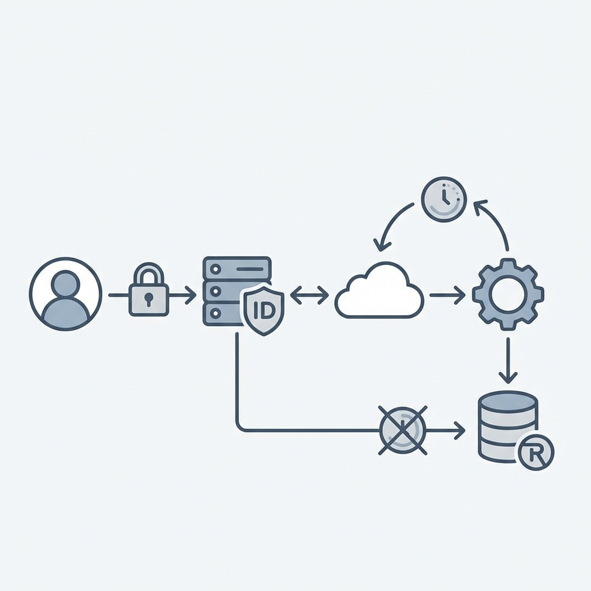

# 🛡️ Failure Scenarios & Resilience: TokenForge

> "Identity is a critical path. If Auth is down, the whole platform is down."

This document details how TokenForge maintains availability during DB outages and attacks.

---

## 1. Failure Matrix

| Component | Failure Mode | Impact | Recovery Strategy |
| :--- | :--- | :--- | :--- |
| **PostgreSQL** | Connection Lost | **Critical**. Cannot Register/Login. | **Circuit Breaker**. Fail-fast logic prevents request pile-up. Existing valid JWTs continue to work (Stateless). |
| **Redis** | Crash / OOM | **Major**. Rate limiting off. | **Fail-Secure**. Login attempts fail (to prevent unlimited guessing). Access Tokens continue validation. |
| **Key Manager** | Private Key Leak | **Catastrophic**. Token Forgery. | **Emergency Rotation**. Admin triggers "Revoke All". Deletes all keys from Redis and generates new RSA Pair instantly. |

---

## 2. Deep Dive: Circuit Breaker Pattern

### The Scenario
The database is overloaded. Waiting 30 seconds for a timeout piles up thousands of `WAIT` connections in Node.js, eventually Crashing the Auth Service.

### The Solution: Fast Failure
We use **Resilience4j** style logic interceptors:
1.  **Monitor**: Count DB failures in a 10s window.
2.  **Open Circuit**: If > 50% fail, stop sending requests immediately.
3.  **Fallback**: Return `503 Service Unavailable` instantly (0ms latency).
4.  **Half-Open**: After 30s, let 1 request through to test health.

---

## 3. Resilience Testing

### Test 1: The "Zombie DB"
1.  Start the app and login.
2.  Stop the DB: `docker stop tokenforge_db`.
3.  Try to Login.
4.  **Expectation**: Immediate `503` (Circuit Open). App does not hang.
5.  Use an existing Access Token on a protected route.
6.  **Expectation**: `200 OK` (Stateless validation requires no DB).

### Test 2: Redis Kill
1.  `docker stop tokenforge_redis`.
2.  Try to login.
3.  **Expectation**: `500` or `503`. System denies login because it cannot set a Session/Refresh Token. This is "Fail-Secure".
