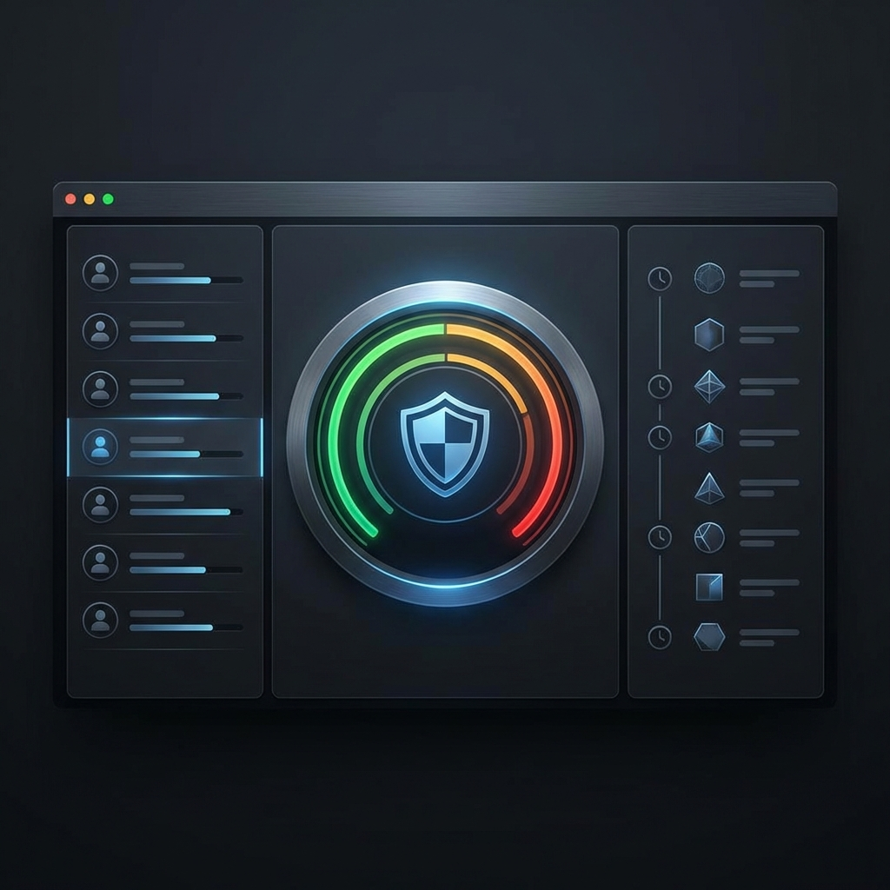

# 🚀 Getting Started: TokenForge

> **Prerequisites**
> *   **Docker Desktop** (PostgreSQL + Redis)
> *   **Node.js v18+**
> *   **npm**



---

## 1. Environment Setup

**Configuration (`backend/.env`)**
Copy the example file to start:
```bash
cd backend
cp .env.example .env
```
*Note: Development defaults (DB: `tokenforge_db`, Pass: `secure_password_dev`) are pre-configured.*

---

## 2. Installation & Launch

### Step 1: Start Infrastructure (DB + Redis)
We use Docker for the stateful components.
```bash
docker-compose up -d
```
*Wait ~10s for Postgres to accept connections.*

### Step 2: Start Auth Service (Backend)
```bash
cd backend
npm install
npm run start:dev
```
*Service is ready when you see `[NestApplication] Nest application successfully started`.*

---

## 3. Usage Guide

### A. Automatic Testing (Recommended)
We provide PowerShell scripts to verify the entire OIDC flow.
```powershell
# Windows
.\scripts\test-api.ps1
```
*This script will Register a user, Login, get Tokens, and access a Protected Route.*

### B. Manual Verification (CURL)

**1. Register**
```bash
curl -X POST http://localhost:3000/api/auth/register \
  -H "Content-Type: application/json" \
  -d '{"email":"admin@test.com", "password":"StrongPass1!", "firstName":"Admin"}'
```

**2. Login**
```bash
curl -X POST http://localhost:3000/api/auth/login \
  -H "Content-Type: application/json" \
  -d '{"usernameOrEmail":"admin@test.com", "password":"StrongPass1!"}'
```
*Response will contain `accessToken` (JWT) and `refreshToken`.*

---

## 4. Running Benchmarks & Tests

### Unit & Integration Tests
```bash
cd backend
npm test
```

### Database Inspection (pgAdmin)
*   **URL**: `http://localhost:5050`
*   **User**: `admin@tokenforge.com`
*   **Pass**: `admin`
*   **Host**: `db`
